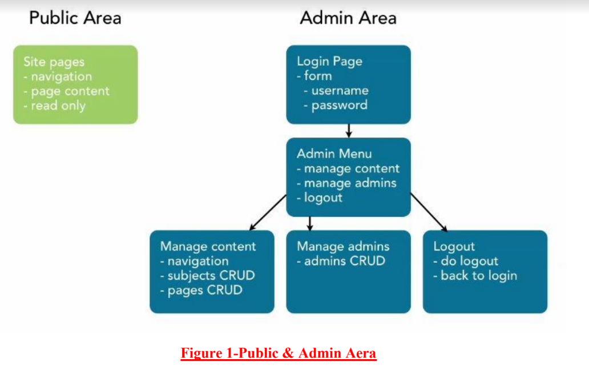

# Content-Management-System
Website that you have to build that two aera, Public Area and Admin area.

Public area (fig-1) is simple having similar page structure. An area for navigation like a menu
and content and aera for the content using pick an item which will show pages contents. Pick a
navigation item, get new items. Site will have sets of pages called subject so picking a subject
and page.

For the admin area (fig-1), there will be login page where you will be asked the user to login
using username and password to gain access and if login fails then try again. If the login is
successful though then it will lead to Admin Menu page. That is simple landing page having
options like manage content, manage admins and logout. Those options are just links that will
bring to different pages. In manage contents, there will be navigation area to navigate between
subject and pages which will allow the admin to do subject CRUD and Page CRUD i.e. Create,
Read, Update and Delete. There will be another CRUD section in admin menu i.e. Manage
admins for admin CRUD which will able to do the add admin using username and password,
delete and edit them. And in final menu option, there will be logout which will be able to logout
from the admin section and take you back from login section again.

ADMIN - 
USERNAME - aayushi
PASSWORD - $2y$10$
